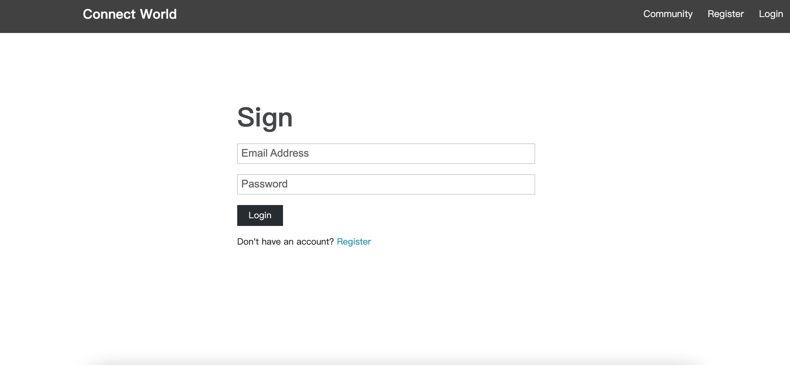
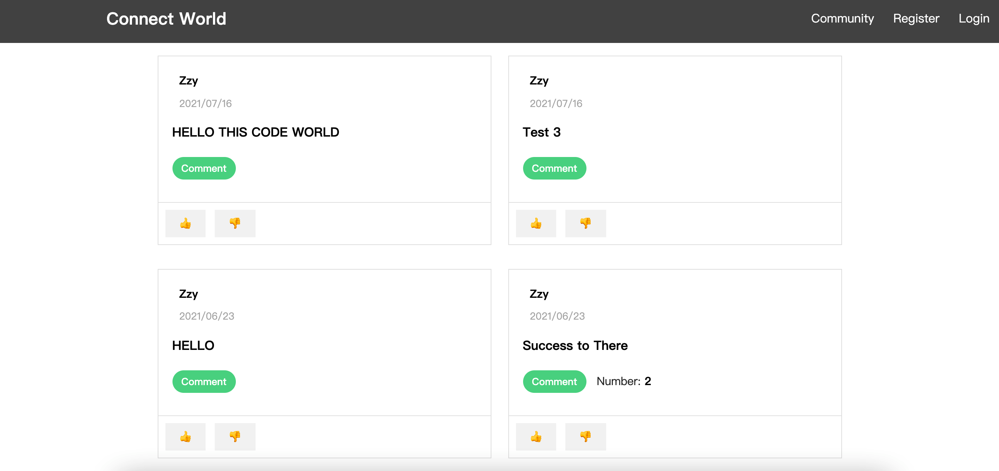

### Full stack project

#### Subject

You must develop a forum website.

Users must be able to login and register.

Users must be able to create subjects (discussions) and to reply to discussions from other users.

Users must be able to upvote or downvote messages from other users.

Users must be able to edit their profile (personal information and profile picture).

#### Guidelines

You must use Nodejs and Express for the backend.

The data base must be a MongoDB.

You must use ReactJS for the frontend.

#### Introduction

**1. ** The “Main Module“

1.1 The “Main Page” Module

1.2 The “Community Page” Module

1.3 The “Login-Register” Module

**2. The “Communicate Module“**

2.1 The “Subject Show” Module

2.1 The “Comment” Module

**3. The “Personal Module“**

